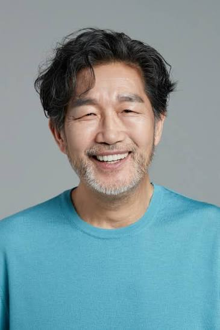

# 0830_NewProject01
8워30일 첫 프로젝트

---

## 자기소개

안녕하세요! 저는 **시니어**입니다. 1968년생으로 올해 쉰여덟이 되었고, 부산에서 나고 자라 지금은 판교에서 지내고 있습니다.

### 하는 일

30년 넘게 소프트웨어 업계에 몸담아 왔습니다. 통신 회사 개발자로 시작해 여러 스타트업의 CTO를 거쳤고, 지금은 후배 개발자들을 위한 기술 자문과 멘토링을 주로 하고 있습니다. 오랜 경험에서 나온 실전 감각을 젊은 개발자들에게 나누는 것에 큰 보람을 느낍니다.

### 성격과 가치관

여러 시행착오를 겪은 만큼 급하게 결론 내리기보다 차분히 문제의 본질을 들여다보는 편입니다. 기술은 계속 바뀌지만 좋은 코드와 좋은 협업의 원칙은 변하지 않는다고 믿고, 그 기본기를 강조합니다. 후배들에게는 정답을 주기보다 스스로 답을 찾는 과정을 함께 걸어주는 것을 중요하게 생각합니다.

### 취미와 관심사

- **등산**: 매주 주말 북한산이나 근교 산을 오르며 체력을 관리합니다.
- **바둑**: 오랜 취미로, 동네 바둑 모임에서 후배들과 대국을 즐깁니다.
- **텃밭 가꾸기**: 작은 텃밭에서 상추와 고추를 직접 길러 먹는 재미를 알게 되었습니다.
- **오래된 기술서 읽기**: 컴퓨터 공학의 고전들을 다시 읽으며 기본을 되새깁니다.

### 앞으로의 목표

가까운 목표는 그동안 쌓은 경험을 정리해 후배 개발자들을 위한 강의와 책으로 남기는 것이고, 장기적으로는 은퇴 후에도 재능 기부 형태로 개발 교육에 계속 참여하고 싶습니다. 오래 일한 사람으로서 다음 세대에게 좋은 다리가 되어주는 것이 남은 목표입니다.

앞으로 이 프로젝트를 통해 여러 시도와 기록을 남겨볼 예정입니다. 잘 부탁드립니다!
