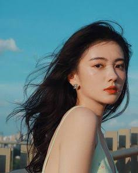

# 0830_NewProject01
8워30일 첫 프로젝트

---

## 자기소개

안녕하세요! 저는 **김소희**입니다. 1996년생으로 올해 서른 살이 되었고, 대구에서 나고 자라 지금은 서울 성수동에서 지내고 있습니다.

### 하는 일

디자인을 전공한 뒤, 지금은 브랜딩 스튜디오에서 그래픽 디자이너로 일하고 있습니다. 주로 스타트업들의 브랜드 아이덴티티와 패키지 디자인을 맡고 있으며, 최근에는 UI/UX 쪽으로도 관심을 넓혀 사이드 프로젝트를 진행하고 있습니다. 사람들이 매일 마주치는 물건이나 화면 속에 작은 즐거움을 담는 것을 목표로 삼고 있습니다.

### 성격과 가치관

세심하고 꼼꼼한 편이라 작업물의 디테일을 놓치지 않으려고 노력합니다. 동시에 새로운 스타일을 시도하는 것을 두려워하지 않아서, 매번 조금씩 다른 결과물을 만들어내려 합니다. 사람들과의 관계에서는 배려를 중요하게 생각하고, 팀 작업에서는 각자의 강점을 살리는 방향을 고민하는 편입니다.

### 취미와 관심사

- **그림**: 업무 외에도 개인 드로잉북에 일러스트를 그리며 감각을 유지합니다.
- **전시 관람**: 주말마다 크고 작은 전시를 찾아다니며 영감을 얻습니다.
- **베이킹**: 스트레스를 풀기 위해 빵과 쿠키를 굽는데, 최근엔 마카롱에 도전 중입니다.
- **필름 사진**: 디지털보다 필름 카메라로 일상을 기록하는 것을 좋아합니다.

### 앞으로의 목표

가까운 목표는 개인 브랜드를 론칭해 직접 디자인한 굿즈를 선보이는 것이고, 장기적으로는 디자인 스튜디오를 독립적으로 운영하며 다양한 브랜드와 협업하고 싶습니다. 디자인으로 사람들의 일상을 조금 더 특별하게 만드는 것이 오래된 꿈입니다.

앞으로 이 프로젝트를 통해 여러 시도와 기록을 남겨볼 예정입니다. 잘 부탁드립니다!
