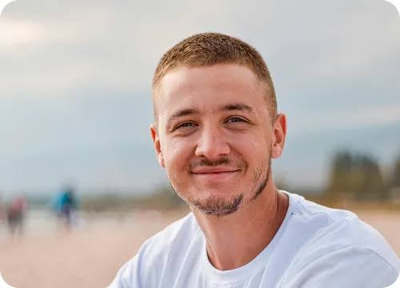

# 0830_NewProject01
8워30일 첫 프로젝트

---

## 자기소개

안녕하세요! 저는 **이도현**입니다. 1994년생으로 올해 서른두 살이 되었고, 서울에서 나고 자라 지금은 강릉 바닷가 근처에서 지내고 있습니다.

### 하는 일

대학에서 컴퓨터공학을 전공한 뒤, 스타트업 두 곳을 거쳐 지금은 소규모 개발팀을 이끌며 여행 관련 서비스를 만들고 있습니다. 백엔드 개발을 주로 담당하지만, 팀원이 적다 보니 프론트엔드와 인프라까지 두루 손대는 편입니다. 사람들이 일상에서 잠깐이라도 여유를 느낄 수 있는 서비스를 만드는 것이 목표입니다.

### 성격과 가치관

호기심이 많아서 새로운 것을 배우는 데 시간 쓰는 것을 아까워하지 않습니다. 계획을 세우기보다는 일단 부딪혀보고 방향을 조정하는 편이라 실패도 많이 겪었지만, 그 과정에서 배운 것들이 지금의 저를 만들었다고 생각합니다. 사람과의 관계에서는 솔직함을 가장 중요하게 여기고, 작은 약속이라도 지키려고 노력합니다.

### 취미와 관심사

- **서핑**: 3년 전 강릉으로 이사 온 뒤로 주말마다 파도를 탑니다. 아직 실력은 초보 수준이지만 바다에 있는 시간 자체가 좋습니다.
- **사진**: 여행하면서 찍은 사진을 SNS에 기록으로 남기고 있습니다. 특히 해질녘 풍경을 좋아합니다.
- **독서**: 에세이와 SF 소설을 즐겨 읽습니다. 최근에는 우주 탐사를 다룬 소설에 푹 빠져 있습니다.
- **커피**: 핸드드립 커피를 직접 내려 마시는 것을 좋아하고, 원두를 로스팅하는 작업실을 차리는 것이 작은 꿈입니다.

### 앞으로의 목표

가까운 미래에는 지금 만들고 있는 서비스를 정식으로 출시하는 것이 목표이고, 장기적으로는 개발과 서핑, 커피를 결합한 작은 워케이션 공간을 운영해보고 싶습니다. 일과 삶의 경계를 너무 뚜렷하게 나누지 않으면서도, 둘 다 소홀히 하지 않는 삶을 만들어가려고 합니다.

앞으로 이 프로젝트를 통해 여러 시도와 기록을 남겨볼 예정입니다. 잘 부탁드립니다!
